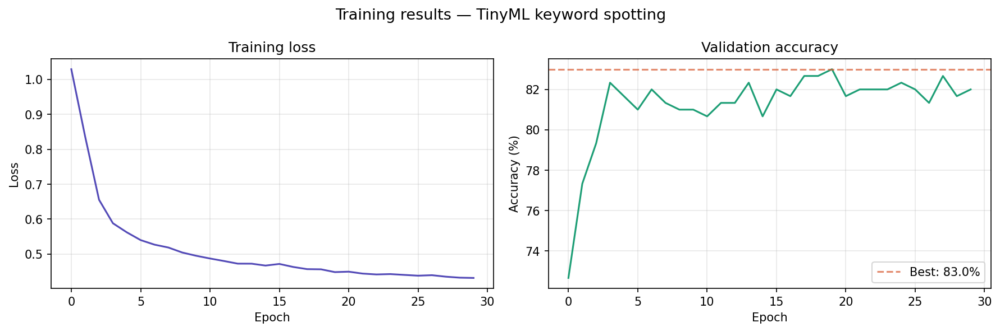
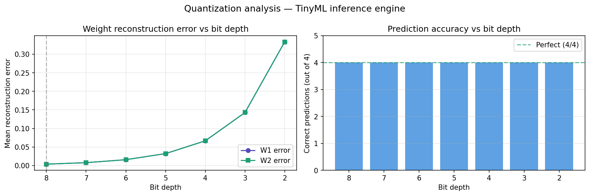
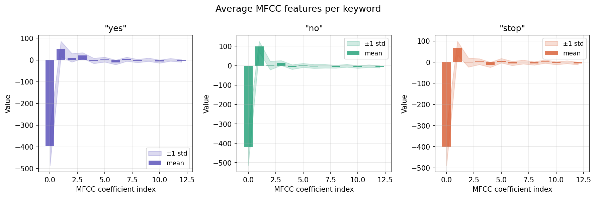

# TinyML Inference Engine — Built from Scratch in C

A neural network inference engine for keyword spotting, written in pure C with no ML libraries — no TensorFlow Lite Micro, no CMSIS-NN. The quantization math, matrix multiplication, and memory layout are all hand-implemented and verified to reproduce a PyTorch reference model's output exactly.

**Task:** classify a 1-second audio clip as `"yes"`, `"no"`, or `"stop"`.
**Target:** ARM Cortex-M4 class microcontroller (256 KB SRAM budget).

---

## Why this project is different from a typical TinyML tutorial

The common path for a TinyML project is: train a model in PyTorch, export it, then hand inference off to TensorFlow Lite Micro, which does the quantization, matrix math, and memory management for you. That's a real skill, but it doesn't require understanding how any of it actually works underneath.

This project skips the library. The inference engine — int8 matrix multiplication, per-layer asymmetric quantization (scale + zero-point), float-domain rescaling, ReLU, re-quantization between layers — is written by hand in C and verified against a PyTorch reference model on real data, not synthetic test cases.

## Headline result

| Stage | Accuracy |
|---|---|
| Float32 (PyTorch) | 83.0% |
| Int8 (Python quantization sim) | 81.7% |
| **Int8 (hand-written C engine)** | **81.7%** — 245/300 validation samples, exact match to Python |

The C engine's output was checked against all 300 real validation samples (not a handful of cherry-picked examples) and matches the Python int8 simulation exactly. That match is the core proof this project sets out to deliver: a from-scratch C implementation of int8 quantized inference, correct enough to reproduce a reference model bit-for-bit on real predictions.

Full results, including memory footprint, ARM cross-compilation, and an honest discussion of where the accuracy ceiling actually comes from, are in [`results/benchmark.md`](results/benchmark.md).



---

## Architecture

```
13 MFCC features
      │
      ▼
 Linear(13 → 64) → ReLU → quantize
      │
      ▼
 Linear(64 → 32) → ReLU → quantize
      │
      ▼
 Linear(32 → 3)  → argmax → class
```

Each layer's weights and each activation tensor has its own int8 scale factor and zero-point, computed independently from that tensor's actual min/max — not a single global scale across the network. This is what keeps the float32 → int8 accuracy drop to 1.3%, versus the larger drop a naive single-scale scheme typically produces.



The three keywords are visually distinguishable in MFCC space even before training, which is what makes this classification task tractable with a small model:



---

## Project structure

```
tinyml-inference-engine/
├── python/
│   ├── week1_foundations.py       # NN math + quantization from scratch (numpy, XOR)
│   ├── week2_quantization.py      # Bit-depth sweep, quantization error analysis
│   ├── week3_dataset.py           # MFCC feature extraction from Speech Commands audio
│   ├── week4_train.py             # PyTorch MLP training + int8 quantization + weights.h export
│   └── export_validation_data.py  # Exports real validation set to a C header for engine verification
├── engine/
│   └── inference_engine.c         # The actual inference engine (see below)
├── weights/
│   └── weights.h                  # Generated: quantized weights, scale/zero-point, norm constants
├── results/
│   ├── benchmark.md               # Full results, including known limitations
│   ├── quantization_analysis.png  # Bit-depth sweep results from Week 2
│   ├── mfcc_visualization.png     # Per-keyword MFCC feature visualization
│   └── training_curves.png        # Loss / validation accuracy over training
└── data/                          # Speech Commands audio → extracted MFCC features
```

---

## `inference_engine.c` — how it works

The engine has two build modes, controlled by a single compile flag:

**Deployment build** (default) — just the inference engine itself: `infer()`, the quantized matmul, ReLU, re-quantization. This is the code that would actually ship on a device. Compiles to **~5 KB flash, ~0.5 KB RAM** on Cortex-M4 (see `results/benchmark.md` for the full breakdown).

```bash
gcc -std=c99 -Wall -Wextra -c engine/inference_engine.c -lm
```

**Validation build** (`-DRUN_VALIDATION`) — includes the 300-sample validation set and a `main()` that runs every sample through `infer()` and reports accuracy against the known labels. This is test scaffolding, not part of the deployable engine.

```bash
gcc -std=c99 -Wall -Wextra -DRUN_VALIDATION -o inference_engine engine/inference_engine.c -lm
./inference_engine
```

**ARM Cortex-M4 cross-compilation** (compile-only — no physical board was available to link/run on):

```bash
arm-none-eabi-gcc -std=c99 -mcpu=cortex-m4 -mthumb -mfloat-abi=hard -mfpu=fpv4-sp-d16 \
  -Wall -Wextra -c engine/inference_engine.c -o inference_engine_deploy.o
arm-none-eabi-size inference_engine_deploy.o
```

### The quantization math

The part of this engine that actually required getting right:

```c
int32_t acc = 0;
for (int j = 0; j < cols; j++) {
    int32_t w  = (int32_t)W[i * cols + j] - W_zp;
    int32_t xv = (int32_t)x[j] - x_zp;
    acc += w * xv;
}
out_f[i] = (float)acc * x_scale * W_scale + bias[i];
```

Two details that are easy to get wrong and silently produce a working-but-incorrect engine:

1. **Zero-point must be subtracted from both operands before multiplying**, not applied as an offset afterward.
2. **Bias must be added in float space, after rescaling** — not added directly into the int32 accumulator. Bias was never quantized, so adding it in integer domain mixes scales that don't match.

Getting this right is the reason the C engine's predictions match Python's int8 simulation exactly, rather than just "running" and producing plausible-looking but silently wrong output.

---

## Reproducing the results

```bash
# 1. Train and quantize (requires PyTorch, numpy, librosa)
python3 python/week3_dataset.py      # builds MFCC dataset from Speech Commands audio
python3 python/week4_train.py        # trains MLP, quantizes, exports weights/weights.h
python3 python/export_validation_data.py   # exports validation set to weights/validation_data.h

# 2. Verify the C engine matches Python
gcc -std=c99 -Wall -Wextra -DRUN_VALIDATION -o inference_engine engine/inference_engine.c -lm
./inference_engine
# Expect: C engine int8 accuracy matching the Python int8 accuracy printed by week4_train.py

# 3. Confirm it compiles for the actual embedded target
arm-none-eabi-gcc -std=c99 -mcpu=cortex-m4 -mthumb -mfloat-abi=hard -mfpu=fpv4-sp-d16 \
  -Wall -Wextra -c engine/inference_engine.c -o inference_engine_deploy.o
arm-none-eabi-size inference_engine_deploy.o
```

---

## Honest limitations

This project does not claim more than it demonstrates:

- **No physical hardware was used.** The engine compiles cleanly for Cortex-M4 with hardware FPU codegen, but was never executed on a real board. Correctness was verified on the host machine instead (the 81.7% exact-match result above).
- **81.7% accuracy is not a strong number in absolute terms.** The likely ceiling is the feature representation, not the model: MFCC features are averaged across the full 1-second clip, which discards most of the temporal structure in speech. A frame-level or sequence-based approach would likely do better — that wasn't the point of this project, which was the inference engine itself, not maximizing classification accuracy.
- **Memory pressure was not a real constraint at this model size.** The unquantized model (11.6 KB) already fits comfortably in a 256 KB SRAM budget. Quantization was implemented to demonstrate the technique correctly, not because this specific model needed it to fit.

Full detail on all of the above is in [`results/benchmark.md`](results/benchmark.md).